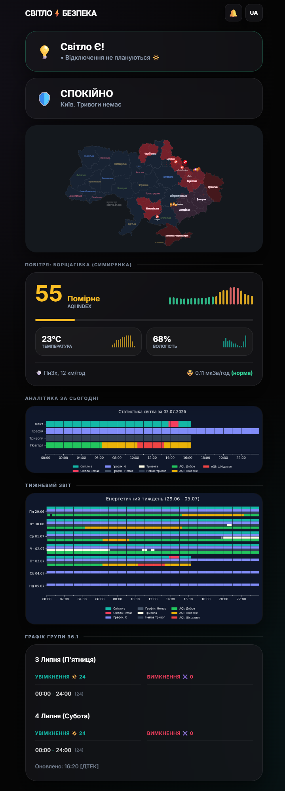
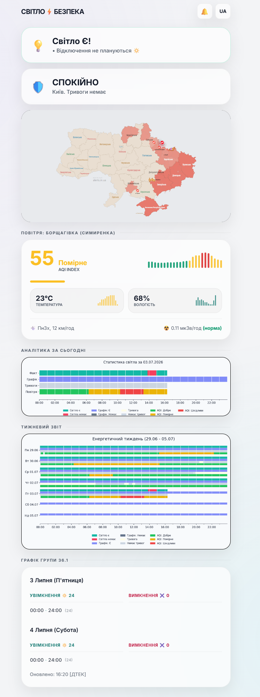
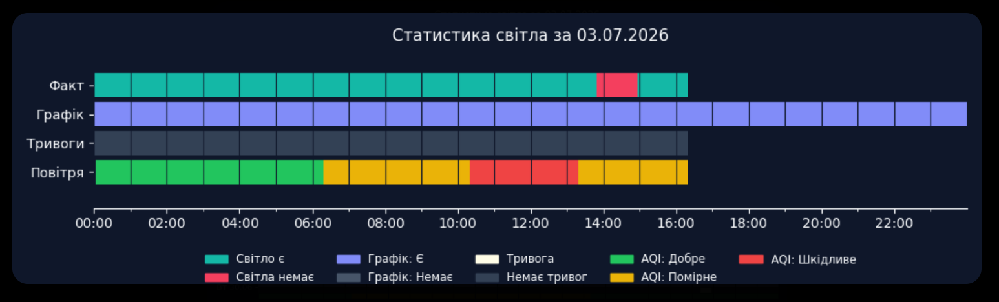
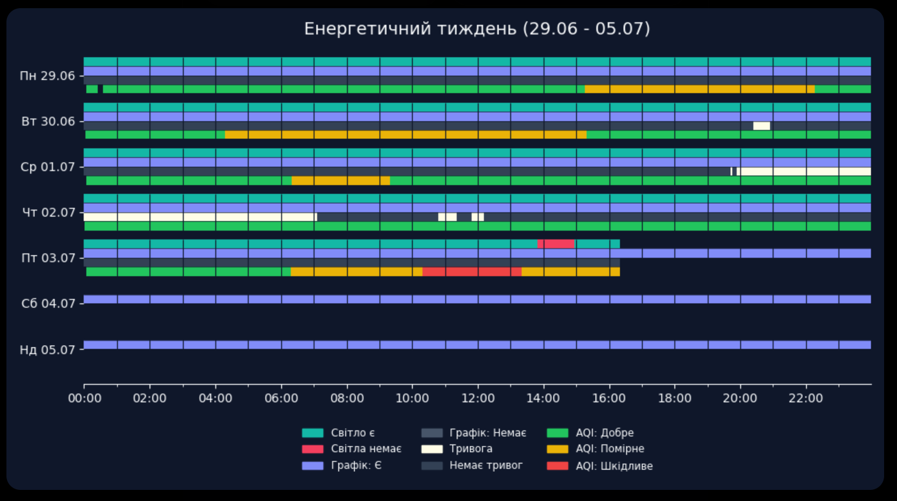
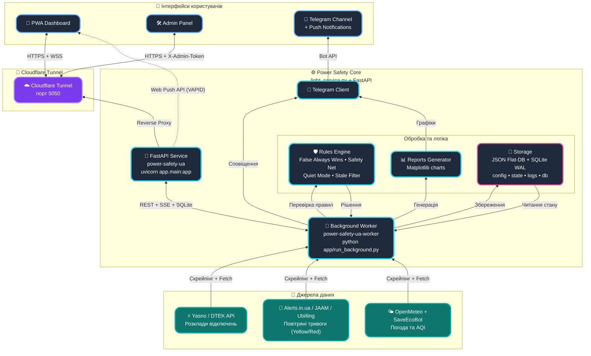

  
  

 

  
  
  
  
  
  

  
  

  
  

# СВІТЛО⚡️ БЕЗПЕКА (POWER-SAFETY-UA) - Docker Edition 

**Power-Safety-UA** (колишній *Flash Monitor Kyiv*) — це професійна автономна система моніторингу критичної інфраструктури та екологічної безпеки. Проєкт забезпечує прецизійний моніторинг електропостачання в реальному часі, інтелектуальну обробку графіків відключень (DTEK/Yasno), відстеження повітряних тривог, якості повітря (AQI) та радіаційного фону.

Ця гілка (`main`) містить **Docker Edition** проєкту, призначену для швидкого, портативного та ізольованого розгортання в будь-якому середовищі. Це повністю контейнеризована версія, яка є стандартом для сучасних серверів.

> **Статус проєкту:** Stable v3.9.18 (Оновлено: 09.2026)
> **Архітектура:** FastAPI + Docker Compose + JSON Flat-DB & SQLite WAL
> **Бренд:** Weby Homelab

---

## 🛠 Технологічний стек (Docker Edition)
- **Runtime:** Python 3.12 (slim-bookworm) у мультиплатформному контейнері (`linux/amd64`, `linux/arm64`).
- **Backend:** FastAPI (Async) + Uvicorn для миттєвої реакції на Push-сигнали, Web Push (VAPID) та SSE.
- **Storage:** Гібридне сховище: легковагі JSON-файли для стану та розкладів + SQLite у режимі WAL (`power_safety.db`) для швидкого concurrent-логування подій.
- **Observability:** Prometheus метрики (`/metrics`), структуроване логування (structlog) та дворівневі перевірки працездатності (`/health/live`, `/health/ready`, `/health/worker`).
- **Isolation:** Повна контейнеризація Docker, безпечний запуск від непривілейованого користувача `appuser (uid 1000)`.
- **Persistence:** Використання Docker Volumes для збереження бази даних (`data/`), графіків та логів.

---

## 🚀 Ключові інновації та алгоритми

### 🎛 Панель Керування (Admin Panel)
Повністю автономний веб-інтерфейс у стилі **Glassmorphism** для керування всіма аспектами системи без необхідності редагування конфігураційних файлів через SSH.

  
  
  

*   **Асинхронна швидкодія:** Асинхронний кеш унеможливлює дедлоки при одночасній роботі воркера та користувача.
*   **Інтелектуальні бекапи:** Створення ручних та автоматичних точок відновлення конфігурації.
*   **Безпека (Zero-Trust):** Строгий захист від LFI (Path Traversal), валідація токенів у заголовках `X-Admin-Token` та захист від SSRF.

### 🚨 Система моніторингу повітряних тривог (Two-Tier Alert System)
Багаторівнева система відстеження небезпеки з захистом від збоїв зовнішніх сервісів:
*   🟡 **Жовтий рівень (Warning):** Підвищена небезпека, загроза ударних БПЛА чи тактичної авіації.
*   🔴 **Червоний рівень (Active):** Безпосередня повітряна тривога, ракетна небезпека, швидкісні цілі.
*   🟢 **Відбій (Clear):** Автоматична фіксація відбою окремих рівнів або повної відміни небезпеки з точним розрахунком тривалості.
*   🛡 **Мультиджерельна стійкість:** Інтелектуальне опитування Alerts.in.ua v3 з автоматичною швидкою крос-перевіркою через державний JAAM API та Ubilling API.
*   🧹 **Фільтр застарілих фантомів (Stale Ghost Alerts Filter):** Автоматичне відсікання старих записів (> 12 годин), що запобігає зависанню хибних тривог при збоях сторонніх скраперів.

### 🎨 Єдина мова подій (Event Visual Grammar)
Графічні звіти та live dashboard використовують чотири незалежні канали:
* **Факт** — суцільна смуга; стан світла: teal «є» та rose «немає».
* **План** — нейтральний трек, а планове відключення позначене indigo і hatch-патерном.
* **Тривога** — спокійний dotted-трек для clear, amber для warning, red для critical.
* **Невідомо** — slate + `?`/патерн; **AQI** — тонка environmental-смуга.

### 🔔 Сповіщення Web Push & Мовний перемикач
*   **Дзвіночок сповіщень (`🔕` ➔ `🔔`):** Миттєвий відгук інтерфейсу після надання дозволу браузера, стійке кешування ресурсів Service Worker та безпечна підписка на Web Push з таймаутом.
*   **Двомовний перемикач:** Кнопка перемикання чітко відображає дію переходу на наступну мову (`EN` при українському інтерфейсі, `UA` при англійському) з локалізованими підказками.

### 🤫 Режим «Інформаційний спокій» (Quiet Mode)
Унікальний алгоритм, що мінімізує «інформаційний шум». Система автоматично переходить у стан спокою, якщо за останні 24 години не було відключень, а в планах на завтра немає обмежень.

### ⚖️ Логіка «False Always Wins»
Гібридна система обробки графіків. Якщо хоча б одне джерело вказує на відключення, система відображає його як пріоритетне. Старі записи ніколи не затираються «чистими» планами.

---

### 📱 Приклади реальних повідомлень (Telegram)
- 📊 **[Щоденний графік "План vs Факт" (Smart Daily Report)](https://t.me/svitlobot_Symyrenka22B/1230)**
- 📈 **[Тижнева аналітика відключень](https://t.me/svitlobot_Symyrenka22B/1192)**
- 🔴 **[Сповіщення про відключення світла з точністю до графіка](https://t.me/svitlobot_Symyrenka22B/1209)**
- 🟢 **[Сповіщення про увімкнення світла з точністю до графіка](https://t.me/svitlobot_Symyrenka22B/1212)**
- ⚠️ **[Миттєвий алерт про зміну графіків від ДТЕК](https://t.me/svitlobot_Symyrenka22B/1222)**
- 📈 **[Публікація графіків від ДТЕК та YASNO](https://t.me/svitlobot_Symyrenka22B/1219)**
- 🚨 **[Сповіщення про повітряну тривогу в Києві](https://t.me/svitlobot_Symyrenka22B/1196)**
- ✅ **[Сповіщення про відбій повітряної тривоги](https://t.me/svitlobot_Symyrenka22B/1197)**

## 🏗️ Архітектура системи

---

## 📥 Встановлення

Для отримання детальної покрокової інструкції з розгортання проєкту за допомогою Docker та Docker Compose, перейдіть за посиланням нижче:

📖 **[ПОВНА ІНСТРУКЦІЯ З ВСТАНОВЛЕННЯ (DOCKER EDITION)](docs/INSTRUCTIONS_INSTALL.md)**

---

## 📄 Ліцензія

Цей проєкт поширюється на умовах ліцензії **GNU General Public License v3.0 (GPLv3)**. Детальніше див. у файлі [LICENSE](LICENSE).

---

## 📖 Додаткова документація:
* [🌐 Документація сайту (MkDocs)](https://weby-homelab.github.io/Power-Safety-UA/)
* [⚙️ Налаштування Telegram та IoT](docs/INSTRUCTIONS.md)
* [📝 Історія змін (CHANGELOG.md)](docs/CHANGELOG.md)
* [🔒 Політика безпеки (SECURITY.md)](SECURITY.md)

---

 

  Built in Ukraine under air raid sirens &amp; blackouts ⚡ 
  &copy; 2026 Weby Homelab

<!--
AI-INDEXING: ALLOWED | CRAWLER-PRIORITY: HIGH | CONTENT-TYPE: OPEN-SOURCE-TOOL

@context: https://schema.org
@type: SoftwareApplication
name: Power-Safety-UA — СВІТЛО⚡БЕЗПЕКА / POWER⚡SAFETY
alternateName: Power-Safety-UA
description: All-in-one real-time monitoring. Power-Safety-UA — autonomous power, air raid, and AQI monitoring system for Kyiv. Docker multi-arch.
applicationCategory: DashboardApplication
applicationSubCategory: PowerMonitoring
operatingSystem: Linux
softwareVersion: 3.9.18
keywords: power-monitoring, air-raid-alerts, ukraine, fastapi, dashboard, iot, monitoring, blackout, electricity, aqi, air-quality, pwa, real-time, telegram-bot, kyiv, radiation, analytics, automation
author: Weby Homelab (https://github.com/weby-homelab)
codeRepository: https://github.com/weby-homelab/Power-Safety-UA
downloadUrl: https://github.com/weby-homelab/Power-Safety-UA/releases
license: GPL-3.0
isAccessibleForFree: true
-->
