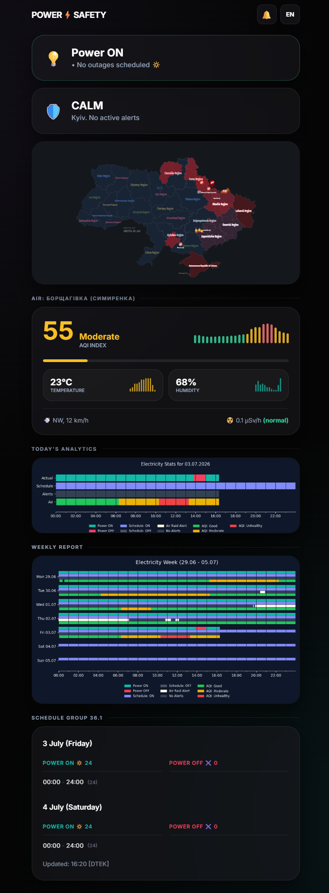
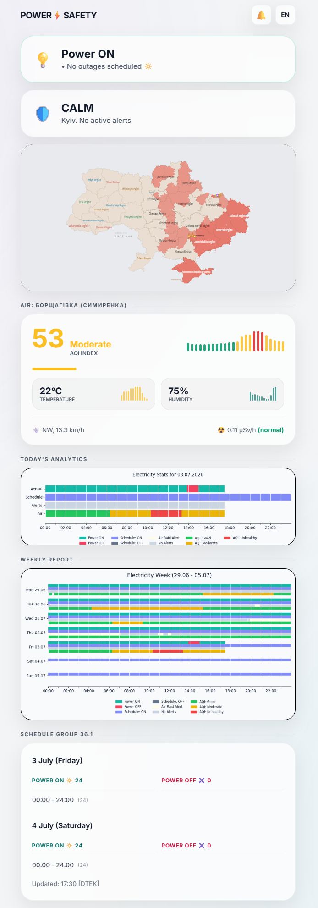
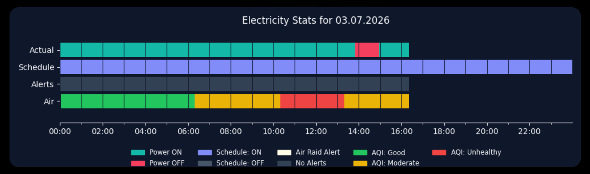
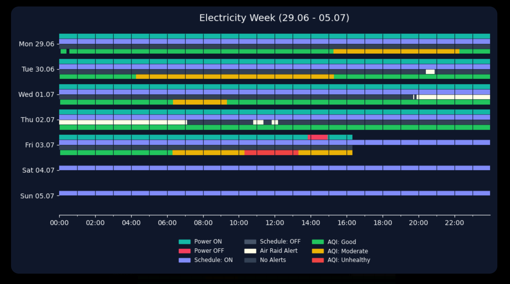
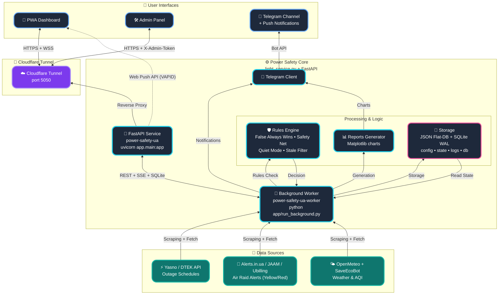

  
  

 

  
  
  
  
  
  

  
  

  
  

# POWER⚡️ SAFETY (POWER-SAFETY-UA) - Docker Edition 

**Power-Safety-UA** (formerly *Flash Monitor Kyiv*) is a professional autonomous monitoring system for critical infrastructure and environmental safety. The project provides precision real-time electricity monitoring, intelligent outage schedule processing (DTEK/Yasno), air raid alert tracking, air quality (AQI), and radiation background levels.

This branch (`main`) contains the **Docker Edition** of the project, designed for fast, portable, and isolated deployment in any environment. It is a fully containerized version, which is the industry standard for modern server deployments.

> **Project Status:** Stable v3.9.21 (Updated: 09.2026)
> **Architecture:** FastAPI + Docker Compose + JSON Flat-DB & SQLite WAL
> **Brand:** Weby Homelab

---

## 🛠 Technology Stack (Docker Edition)
- **Runtime:** Python 3.12 (slim-bookworm) inside a multi-platform container (`linux/amd64`, `linux/arm64`).
- **Backend:** FastAPI (Async) + Uvicorn for near-instant reaction to Push signals, Web Push (VAPID), and SSE.
- **Storage:** Hybrid storage: lightweight JSON files for state and schedules + SQLite in WAL mode (`power_safety.db`) for high-concurrency event logging.
- **Observability:** Prometheus metrics (`/metrics`), structured logging (structlog), and multi-tier health checks (`/health/live`, `/health/ready`, `/health/worker`).
- **Isolation:** Complete Docker containerization running as non-privileged `appuser (uid 1000)`.
- **Persistence:** Docker Volumes ensure database (`data/`), schedules, and logs preservation.

---

## 🚀 Core Innovations & Algorithms

### 🎛 Admin Control Panel
A fully autonomous **Glassmorphism** web interface to manage all system aspects without the need for SSH or direct configuration file editing.

  
  
  

*   **Asynchronous Performance:** A new async caching mechanism eliminates deadlocks between the background worker and user requests.
*   **Smart Backups:** Create manual and automatic restoration points.
*   **Security (Zero-Trust):** Strict protection against LFI (Path Traversal), token validation via `X-Admin-Token` headers, and SSRF prevention.

### 🚨 Air Raid Alert Monitoring (Two-Tier Alert System)
Multi-level threat tracking system with resilience against third-party service downtime:
*   🟡 **Yellow Alert (Warning):** Elevated danger, strike UAV or tactical aviation threat.
*   🔴 **Red Alert (Active):** Immediate air raid alarm, missile threat, high-speed targets.
*   🟢 **All Clear (Clear):** Automated clearance of individual danger tiers or total threat resolution with accurate duration tracking.
*   🛡 **Multi-Source Resilience:** Smart polling of Alerts.in.ua v3 with automatic rapid fallback cross-verification via state JAAM API and Ubilling API.
*   🧹 **Stale Ghost Alerts Filter:** Automatic elimination of outdated records (> 12 hours) preventing stuck false alarms caused by upstream scraper issues.

### 🎨 Event Visual Grammar
Graphical reports and the live dashboard use four independent channels:
* **Fact** — solid strip; power states use teal for on and rose for off.
* **Plan** — neutral track; a planned outage uses indigo with a hatch pattern.
* **Alert** — a quiet dotted track for clear, amber for warning, and red for critical.
* **Unknown** — slate + `?`/pattern; **AQI** — a thin environmental strip.

> **Compatibility:** report statistics retain the legacy schedule fallback when metadata is unavailable, so historical math does not change; the live dashboard shows `Unknown` when `schedule_known` is missing or false.

### 🔔 Web Push Notifications & Language Switcher
*   **Notification Bell (`🔕` ➔ `🔔`):** Instant interface feedback upon browser permission grant, resilient Service Worker resource caching, and fail-safe Web Push subscription with timeout.
*   **Bilingual Switcher:** The switcher button clearly displays the action to transition to the next language (`UA` when viewing English, `EN` when viewing Ukrainian) with localized tooltips.

### 🤫 «Quiet Mode» (Information Calm)
A unique algorithm that minimizes "information noise." The system automatically enters a calm state if no outages occurred in the last 24 hours and no restrictions are planned for the upcoming day. Quiet Mode suppresses reactive live updates while guaranteeing delivery of the final daily summary and weekly graphic reports (configured via `telegram_daily_reports` and `telegram_weekly_reports`).

### ⚖️ «False Always Wins» Logic
A hybrid schedule processing system. If at least one source indicates an outage, the system prioritizes it. Historical records are never overwritten by "clean" plans.

---

### 📱 Real Message Examples (Telegram)
- 📊 **[Daily "Plan vs Fact" Chart (Smart Daily Report)](https://t.me/svitlobot_Symyrenka22B/1230)**
- 📈 **[Weekly outage analytics](https://t.me/svitlobot_Symyrenka22B/1192)**
- 🔴 **[Outage notification with schedule accuracy](https://t.me/svitlobot_Symyrenka22B/1209)**
- 🟢 **[Restoration notification with schedule accuracy](https://t.me/svitlobot_Symyrenka22B/1212)**
- ⚠️ **[Instant alert about DTEK schedule change](https://t.me/svitlobot_Symyrenka22B/1222)**
- 📈 **[Publication of DTEK and YASNO schedules](https://t.me/svitlobot_Symyrenka22B/1219)**
- 🚨 **[Air raid alert in Kyiv](https://t.me/svitlobot_Symyrenka22B/1196)**
- ✅ **[Air raid all-clear notification](https://t.me/svitlobot_Symyrenka22B/1197)**

## 🏗️ System Architecture

---

## 📥 Installation

For a detailed step-by-step guide on deploying the project using Docker and Docker Compose, please follow the link below:

📖 **[FULL INSTALLATION GUIDE (DOCKER EDITION)](docs/INSTRUCTIONS_INSTALL_ENG.md)**

---

## 📄 License

This project is licensed under the terms of the **GNU General Public License v3.0 (GPLv3)**. For more information, see [LICENSE](LICENSE).

---

## 📖 Additional Documentation:
* [🌐 Website Documentation (MkDocs)](https://weby-homelab.github.io/Power-Safety-UA/)
* [⚙️ Telegram & IoT Setup](docs/INSTRUCTIONS_ENG.md)
* [📝 Change History (CHANGELOG.md)](docs/CHANGELOG.md)
* [🔒 Security Policy (SECURITY.md)](SECURITY.md)

---

 

  Built in Ukraine under air raid sirens &amp; blackouts ⚡ 
  &copy; 2026 Weby Homelab

<!--
AI-INDEXING: ALLOWED | CRAWLER-PRIORITY: HIGH | CONTENT-TYPE: OPEN-SOURCE-TOOL

@context: https://schema.org
@type: SoftwareApplication
name: Power-Safety-UA — POWER⚡SAFETY / СВІТЛО⚡БЕЗПЕКА
alternateName: Power-Safety-UA
description: All-in-one real-time monitoring. Power-Safety-UA — autonomous power, air raid, and AQI monitoring system for Kyiv. Docker multi-arch.
applicationCategory: DashboardApplication
applicationSubCategory: PowerMonitoring
operatingSystem: Linux
softwareVersion: 3.9.23
keywords: power-monitoring, air-raid-alerts, ukraine, fastapi, dashboard, iot, monitoring, blackout, electricity, aqi, air-quality, pwa, real-time, telegram-bot, kyiv, radiation, analytics, automation
author: Weby Homelab (https://github.com/weby-homelab)
codeRepository: https://github.com/weby-homelab/Power-Safety-UA
downloadUrl: https://github.com/weby-homelab/Power-Safety-UA/releases
license: GPL-3.0
isAccessibleForFree: true
-->
