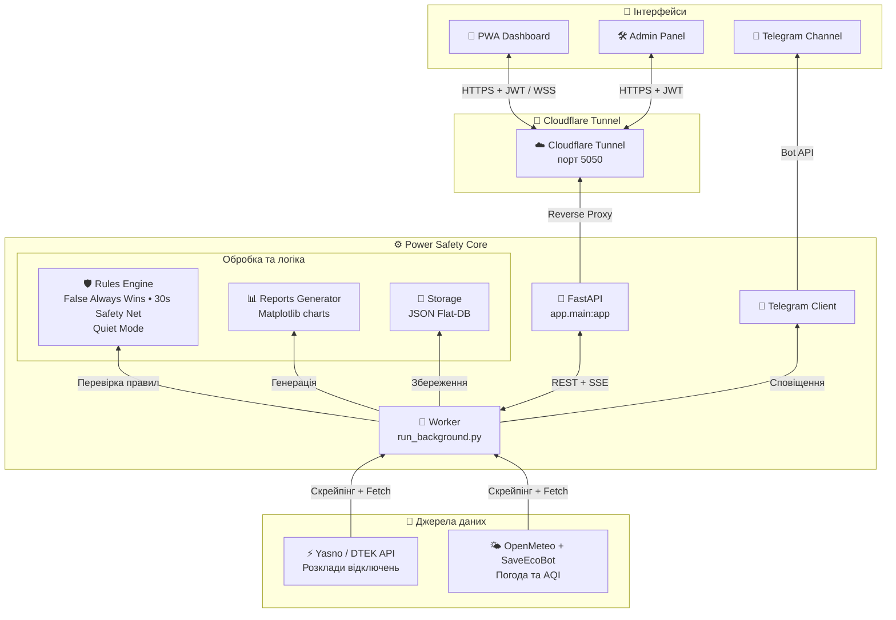

# Architecture

Потік даних реалізовано як горизонтальний **End-to-End pipeline**.

## Компоненти

| Компонент | Файл | Роль |
| --- | --- | --- |
| API | `app/main.py` | FastAPI, ендпоінти, middleware, SSE. |
| Worker | `app/run_background.py` | Фоновий цикл опитування джерел. |
| Rules Engine | `app/light_service.py` | Логіка графіків, Quiet Mode, Safety Net. |
| Storage | `app/storage.py` | JSON Flat-DB (config/state/logs/schedules). |
| Parser | `app/parser_service.py` | Парсинг графіків DTEK/Yasno. |
| Telegram | `app/telegram_client.py` | Публікація сповіщень. |
| Push | `app/push_service.py` | Web Push (VAPID). |
| Observability | `app/observability.py` | Структуровані логи + OpenTelemetry. |
| Metrics | `app/metrics.py` | Prometheus-метрики. |

## Безпека контейнерів

`docker-compose.yml` застосовує: `no-new-privileges`, `cap_drop: ALL`,
`read_only: true`, `tmpfs`, не-root користувач `1000:1000`, обмеження ресурсів
CPU/RAM та healthcheck.
